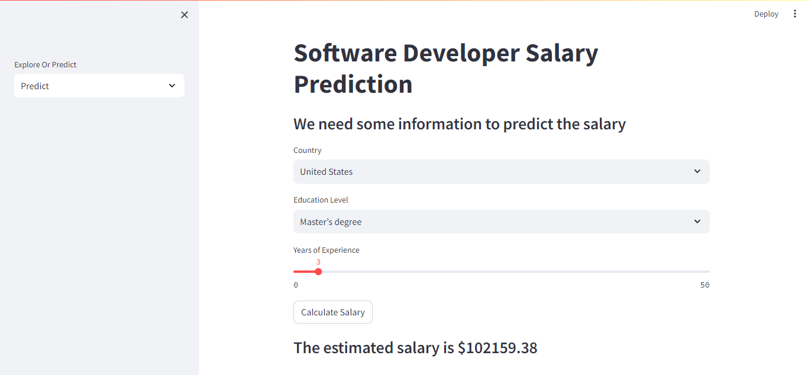

# Build A Salary Prediction Web App With Streamlit

Build a Machine Learning web application from scratch in Python with Streamlit which contains Prediction page and Explore/Visualisation page.

##Overview
In this project I will use machine learning to predict average salary of Software engineer based on parameters like Degree, Year of experiance, Country. I have created web application using streamlit.

#Predict page

